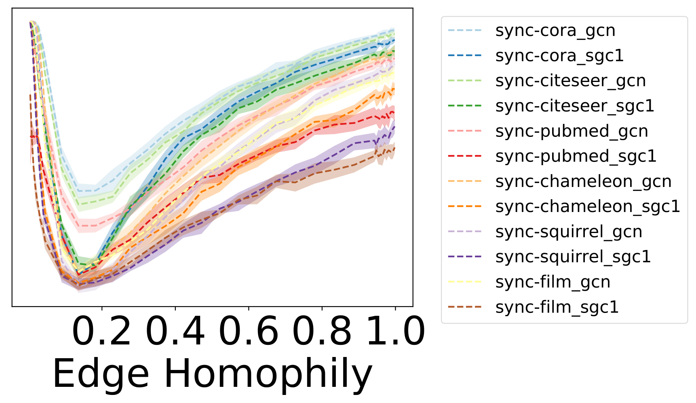
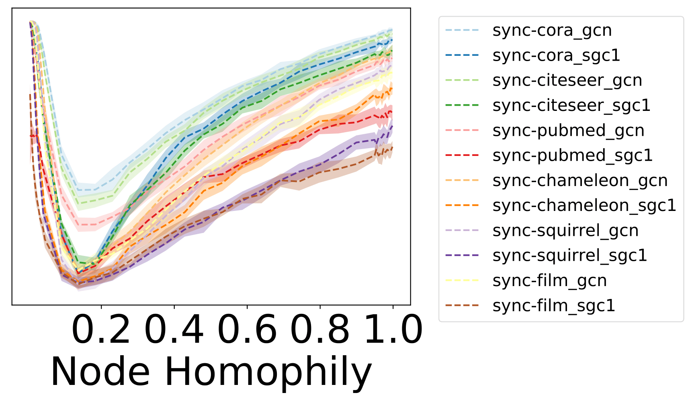
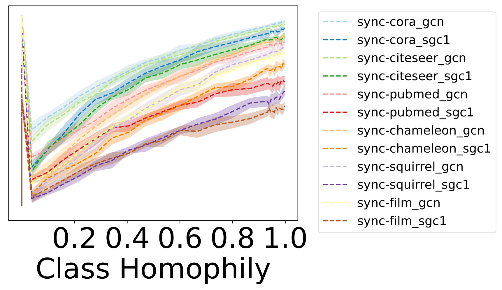
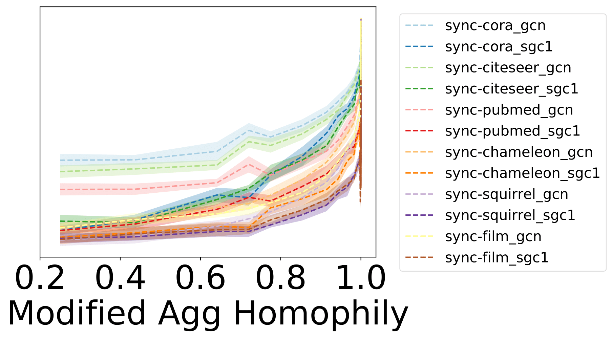
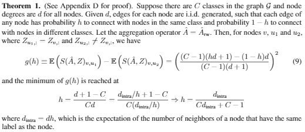
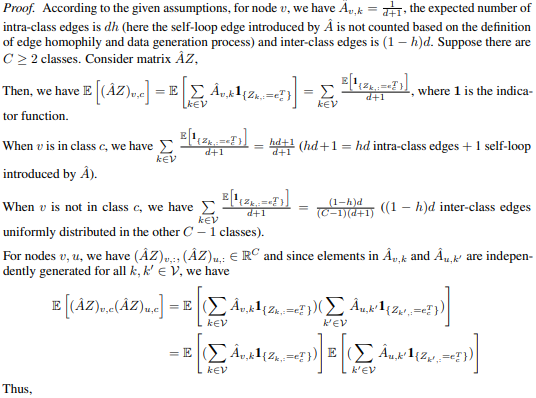
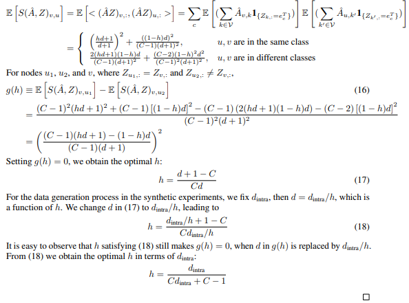

# Neurips2021-Materials for Replies to Reviewers

## Updated Figure regarding baseline performance under edge homophily

## Updated Figure regarding baseline performance under node homophily

## Updated Figure regarding baseline performance under class homophily

## Updated Figure regarding baseline performance under modified aggregation homophily

## Revised Theorem 1 and its proof

